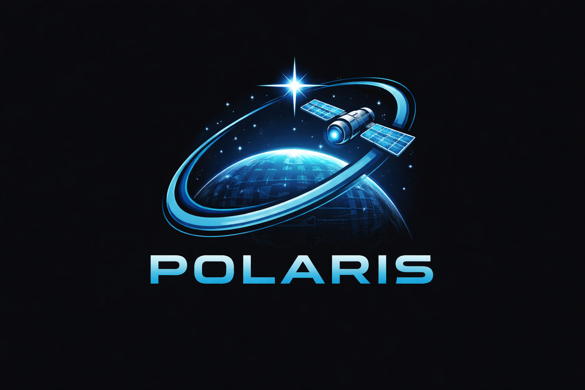
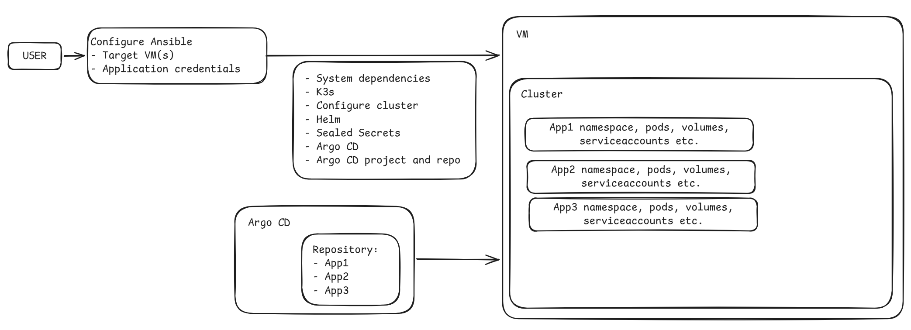

# Welcome to Polaris

*Polaris* is a code name for the in house Argo CD based development cluster at Eurac Research Institute of Earth Observation.

This documentation provides all the necessary information to understand, deploy, and manage Polaris. It is organized into several sections.

The goal of this setup is to provide a ready-to-use Kubernetes cluster with a set of pre-installed applications and tools that can be used for development, testing, and experimentation. The cluster is designed to be lightweight and easy to manage.

## Background

Since many projects operate in a Kubernetes environment, it is important to have a development cluster that we can use as a testing ground. Depending on the project, the support from other teams may be limited, and therefore we decided to set up our own cluster. This allows us to have full control over the environment and ensures that we can test our applications in a consistent and reliable way.

This setup allows us to make and break things without worrying about affecting other teams or projects. It also provides a platform for experimentation and learning, which is essential for staying up-to-date with the latest technologies and best practices in the Kubernetes ecosystem.

## Design goals

The design goals of Polaris have been simple from the start:

- **Simplicity**: The cluster should be easy to set up and manage, with a minimal learning curve for developers/scientists who may not be familiar with Kubernetes.
- **Flexibility**: The cluster should be flexible enough to accommodate a wide range of applications and use cases, from simple web applications to complex data processing pipelines.
- **Scalability**: The cluster should be able to scale up and down as needed, to accommodate changing workloads and resource requirements.
- **Security**: The cluster should be secure by default, with appropriate access controls and isolation between different applications and users.
- **Configurability**: The cluster should be easily configurable, with a clear and consistent way to manage applications and resources.

## Architecture and tools

The deployment of the cluster is handled with [Ansible](https://docs.ansible.com/projects/ansible/latest/getting_started/introduction.html?extIdCarryOver=true&intcmp=7015Y000003t7aWQAQ&sc_cid=RHCTG0180000382536), which allows us to automate the setup and configuration of the cluster.

The cluster itself is based on [K3s](https://k3s.io/), a lightweight Kubernetes distribution that is designed for development and testing environments.

The setup is defined in a way to make it as easy as possible to go from nothing to a fully functional cluster with some configuration and a couple of commands.

### Setup diagram

## Installation

To setup Polaris, you can follow the instructions in the [Installation](installation.md) section of this documentation. This section provides step-by-step instructions for installing and configuring the cluster, as well as troubleshooting tips and best practices for managing the cluster.

For a multi-node setup (1 master + 2 workers), see the [Multinode Installation](multinode.md) page.

## Uninstallation

Sometimes things go so wrong that it is easier to just start from scratch. In that case, you can follow the instructions in the [Uninstallation](uninstall.md) section of this documentation.
